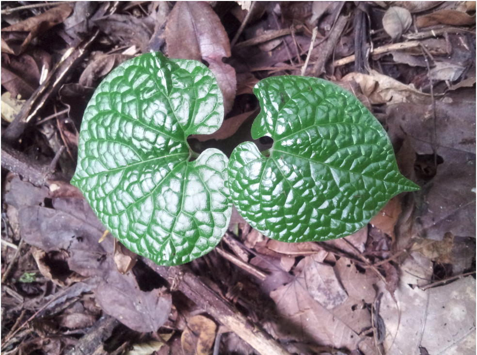

The Garrett Lab addresses opportunities to improve systems that support food security and conservation. Current projects include systems analysis of seed health, crop disease management, and microbiomes.

See more about the Garrett Lab at:  [website](https://www.garrettlab.com).

 

## Instructors 

**Ravin Poudel** 

<i class="fa fa-envelope-square" aria-hidden="true"></i> [email](mailto:raveenpoudel@gmail.com)  

**Ashish Adhikari** 

<i class="fa fa-envelope-square" aria-hidden="true"></i>
[email](mailto:adhikariashish@ufl.edu)

**Karen Garrett** 

<i class="fa fa-envelope-square" aria-hidden="true"></i> [email](mailto:karengarrett@ufl.edu)

  

 

