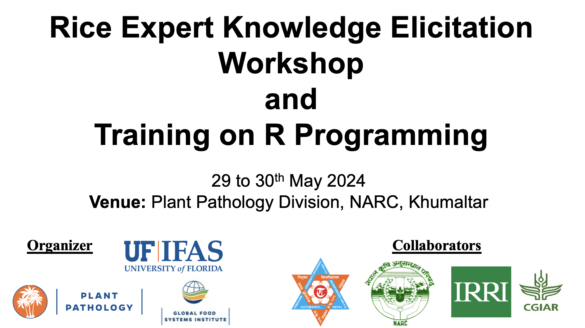

{width=1000px}
  
---------------------------------------------------------
**University of Florida team:**

- Dr. Ashish Adhikari,
- [Dr. Ravin Poudel](https://github.com/ravinpoudel),
- [Dr. Karen Garrett](https://www.garrettlab.com)
- In collaboration with [International Rice Research Institute](https://www.irri.org)

The University of Florida component of the workshop and expert knowledge elicitation will include these main components:

- A workshop introducing the R programming environment
- A workshop on applications of R for analysis of epidemiological data
- Expert knowledge elicitation addressing rice health, as a component of a **rice health risk assessment for Nepal**

The rice health risk assessment uses the R2M toolbox: rapid risk assessment to support mitigation of crop pests and diseases: [garrettlab.com/r2m](https://www.garrettlab.com/r2m/)

**Objectives of the rice health synthesis for Nepal**

1. Provide a rapid risk assessment to support mitigation of rice pests and diseases in Nepal, based on:
    - Cropland connectivity analysis to identify key geographic locations for surveillance and management of pests and diseases in Nepal and the surrounding region
    - Expert knowledge elicitation to summarize current understanding of rice systems in Nepal
    - Scenario analysis of potential national management strategies for rice pests and diseases in Nepal
    - Trade network analyses of the potential for rice pest and pathogen spread internationally

2. : Provide shared learning experiences for students in Nepal and at University of Florida

3. : Develop a peer-reviewed journal article based on our shared understanding

**The benefits we want this project to provide to collaborators in Nepal**

  * **Workshops**: Capacity development for students and professionals
  * **Expert knowledge elicitation**: New synthesis of information about priorities for rice pest and disease management in Nepal, including emerging threats
  * **Policymakers will benefit** from a new synthesis of rice health challenges and strategies
  * **New synthesis of rice systems in Nepal**, including formal and informal trade and rice health implications

**What we would ask from collaborators in Nepal**

  * Helping to **identify a team of approximately 20 regional experts on pests and diseases of rice in Nepal** who could participate in expert knowledge elicitation
  * Helping with facilities for the workshop and expert knowledge elicitation

**Potential Regional Experts**

Here we are defining regional experts as those who have experience with rice health throughout a region (as opposed to being experts only on a single farm)

- NARC officers/field staffs
- DADO officers/ field staffs/ extension agents/ JT/As
- Industry personnel / agrovets / …
- Growers/ farmers / farm staffs/ Managers
- TU faculties/staffs

***Contact information for University of Florida team***

- Ashish Adhikari, adhikariashish@ufl.edu
- Ravin Poudel, raveenpoudel@gmail.com 
- Karen Garrett, karengarrett@ufl.edu 

