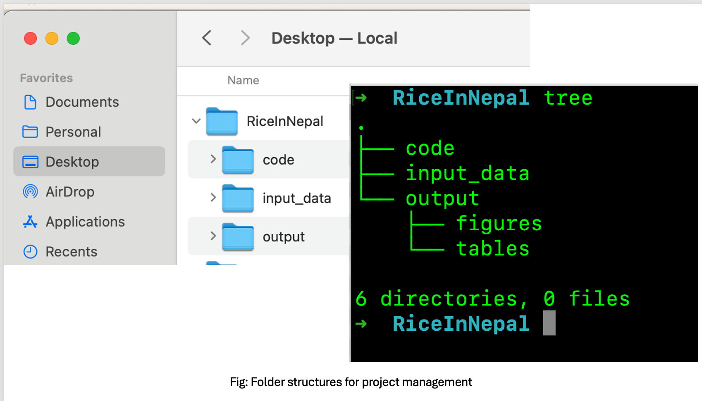
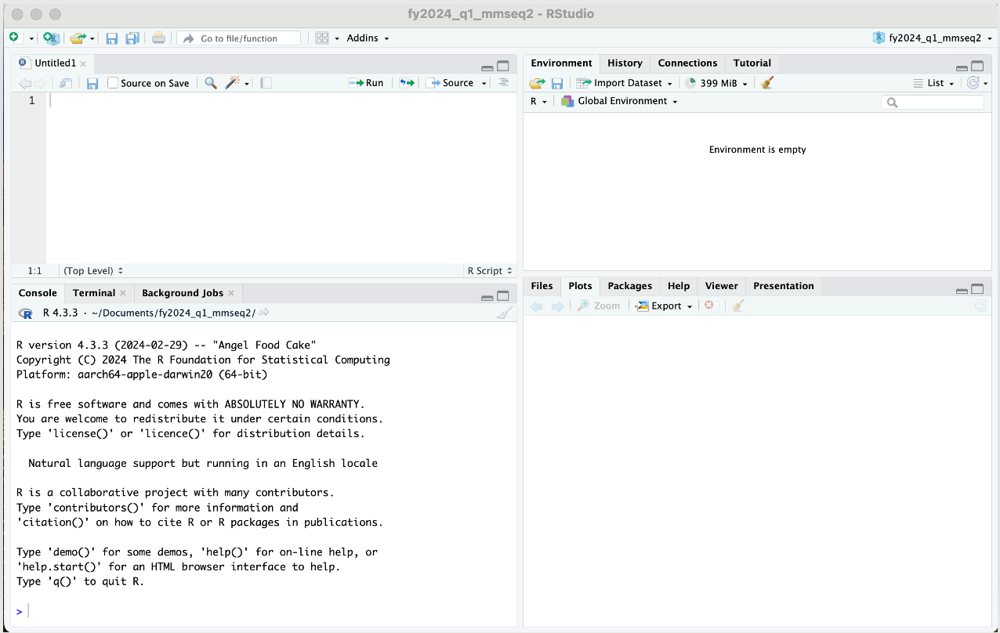
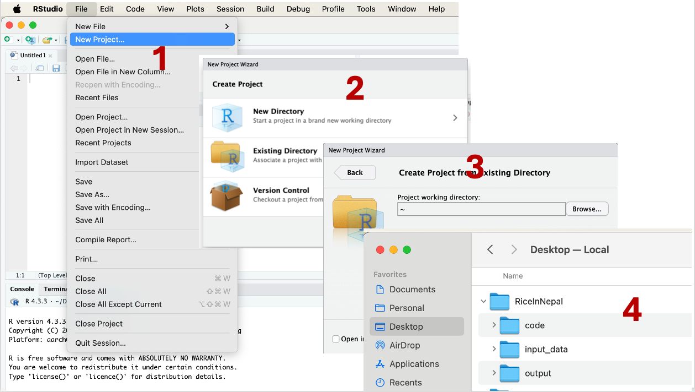
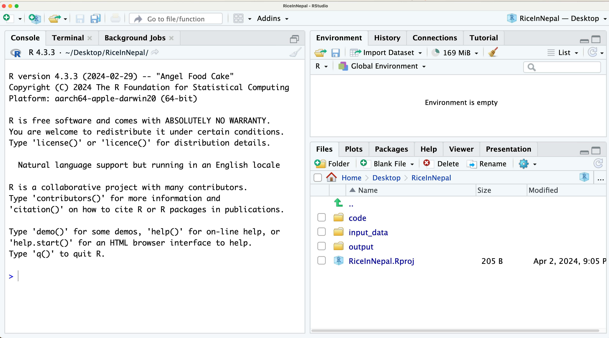
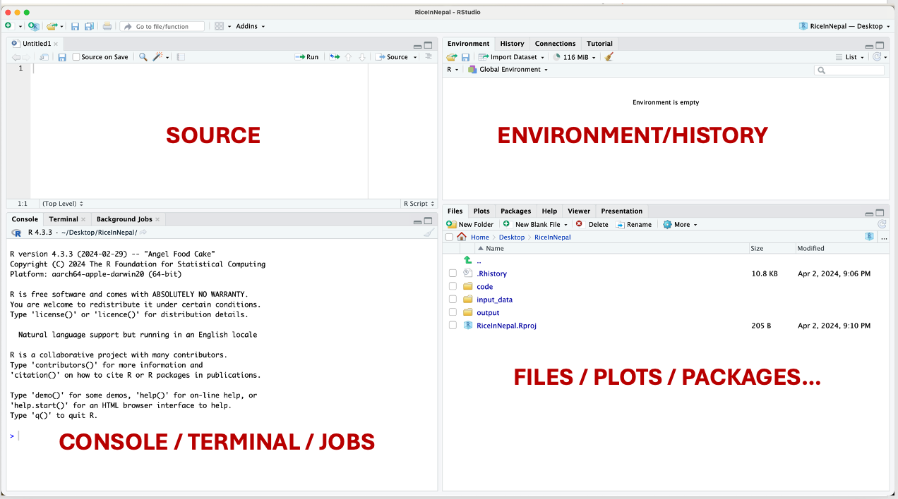
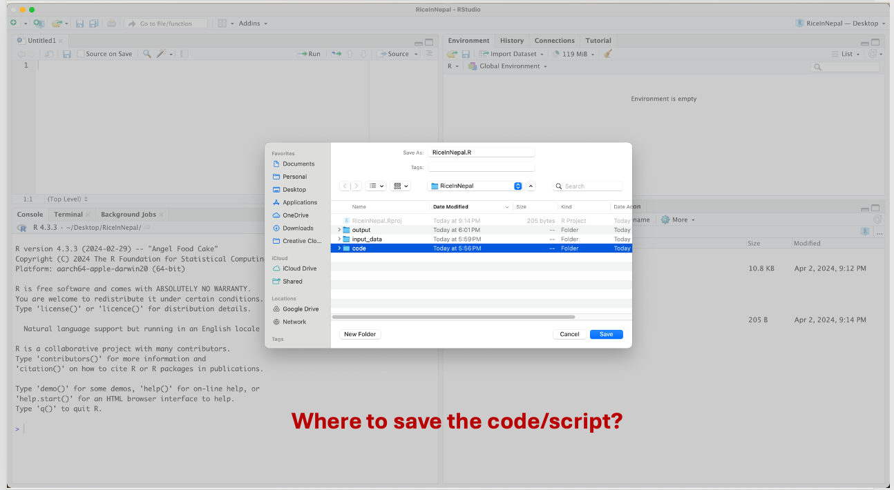

<br>
<div class = "blue">
### Learning objectives

* Learn how to manage and structure R project
* Gain familiarity the RStudio IDE
*	Understand the R environment and RStudio
* Understand pros and cons of R
* Learn how to setup working directory, and understand its importance in project management
</div>
<br>

## Before we open-up R

---

As is true in building anything, we need to start with a plan. It's no different when we are building an R project. We will begin by creating a structural plan outlining how we organize input files, where and how we will save our results, and the development of our code. A well-thought-out plan helps us to be meticulous in organizing files and folders, and also supports the reproducibility aspect of the project.

Let's first navigate to the **Desktop** of your computer and create a folder called **RiceInNepal**. This folder will serve as the location for our code, input data, output, and all the materials needed or generated during our workshop. You can apply the same approach for this workshop or any other project we undertake in the future.

Once you have created a folder named **RiceInNepal** on the Desktop, we will proceed to structure our project with subfolders and files. Let's create three additional folders inside the **RiceInNepa** folder:

- **input_data**: This folder will contain our input data.

- **output**: Inside the output folder, let's create two additional folders:
  - **figures**
  - **tables**

- **code**: This folder will house all of the R code generated during this workshop.

Once completed, your **RiceInNepal** folder should have the following structure:

```
RiceInNepal
│   input_data
│
└───output
│   │   figures
│   │   tables
│
└───code
```

This structure ensures a systematic organization of our project materials, facilitating ease of access and reproducibility.

--- 
Once done, your "RiceInNepal" should have following folders and subfolders:

{width=500xpx}


What if do we need to do this?

  - Disorganized
  - Code, inputs, outputs hard to find, and version
  - Difficult to reproduce by other, as input file are linked/defined based on your laptop paths
  
How to solve this problem?

  - Create self-contained projects in RStudio
  - For each project create one folder
  - Keep all the code, data, output are generated within this folder

Benefits:

  - Organized
  - All materials associated with the project are within ONE folder
  - You can share this folder to your colleges/friends, and should be able to run the code and generate the analyses


## Lets open-up R/RStudio


### What is R?

R is a free software environment that includes a set of base packages for graphics, math, and statistics. You can also make use of specialized packages contributed by R users or write your own new functions. R was developed as a part of the GNU project from the S language.


**Advantages**

- Offers direct programmability and extensibility, serving as a complete programming language.
-	Benefits from extensive community support, with numerous robust advanced packages readily available.
-	Provides comprehensive built-in functionalities for data manipulation, analysis, and scientific visualization.
-	Free of cost!


However, becoming proficient in R and mastering its intricacies may entail a steep learning curve (which we are about to embark upon). Specifically, R can be daunting at first glance: with its customizable and extensible programming framework, users must navigate through a mix of core language features and a plethora of built-in or extended functions offered by base and add-on packages, respectively. 

**R is unforgiving**; it diligently attempts (sometimes overly so!) to execute given commands, often resorting to complex and unexpected data transformations to achieve results, even if they do not align with the user's expectations.

 Effectively utilizing R necessitates learning diagnostic techniques and cultivating the habit of testing and validating intermediate steps. While R lacks professional or commercial support, a plethora of resources including books, tutorials, manuals, and mailing lists are available both online and offline.


### What is RStudio?

RStudio is an integrated development environment (IDE) specifically designed for working with the R programming language. It provides a user-friendly interface for writing code, running scripts, visualizing data, and managing projects. RStudio offers several features that enhance the R programming experience, including:

1. **Script Editor**: RStudio includes a script editor with features such as syntax highlighting, code completion, and code folding, which make writing and editing R code more efficient.

2. **Console**: It includes a console where R code can be executed interactively. Users can run individual commands, view output, and debug code directly within the console.

3. **Data Viewer**: RStudio's data viewer allows users to easily explore and interact with data frames and other R objects. It provides a spreadsheet-like interface for viewing data, making it easier to understand its structure and contents.

4. **Plots and Visualization**: RStudio provides tools for creating and customizing plots and visualizations directly within the IDE. Users can generate a wide variety of charts and graphs using R's powerful plotting capabilities.

5. **Package Management**: RStudio includes features for managing R packages, such as installing, updating, and loading packages. It also provides tools for browsing and searching packages from CRAN (Comprehensive R Archive Network) and other repositories.

6. **Project Management**: RStudio supports project-based workflows, allowing users to organize their R code, data, and related files into projects. Projects help maintain a clean directory structure and make it easier to collaborate with others.

7. **Version Control**: RStudio integrates with version control systems such as Git and SVN, enabling users to track changes to their code and collaborate with others more effectively.

Overall, RStudio is a powerful and user-friendly environment for working with R, suitable for both beginners and experienced R users alike.


Now, we have plan for the projecet. Lets open R in RStuido, which should look like the following:

{width=500xpx}

Now we need to create a Rproject. To do so, we need follow the steps as shown in the figure below, and save the .Rproj file inside the **RiceInNepal** folder in *Desktop**. 

{width=500xpx}

At this point, you should be able to see a file called **RiceInNepal.Rproj**.

{width=200xpx}

### What do you see in RStudio?

{width=200xpx}

In RStudio, the interface typically consists of four main sections:

1. **Source Editor**: This is where you write your R scripts or Markdown documents. It provides features like syntax highlighting, code completion, and other tools to aid in writing and editing code.

2. **Console**: The console is where you can directly interact with R. You can execute individual commands or entire scripts, and the results are displayed here. It's also where you see error messages and warnings.

3. **Environment/History**: This section shows you information about the current R environment, including the objects (variables, functions, etc.) that are currently defined, along with their values. The history tab displays a history of commands that you've executed in the console.

4. **Files/Plots/Packages/Help**: This is a panel with tabs for various functionalities:
   - **Files**: Allows you to navigate through your file system and manage files and directories.
   - **Plots**: Displays plots generated by R.
   - **Packages**: Shows information about installed packages and allows you to install, update, and remove packages.
   - **Help**: Provides access to documentation and help files for R functions and packages.

These sections provide a comprehensive environment for coding, executing, and managing R projects efficiently.

### Where to save the code/script?

{width=200xpx}

### Working Directory and File Paths

In R, the working directory is the directory or folder on your computer where R will look for files and where it will save files by default unless otherwise specified. When you start an R session, it sets a default working directory, usually the directory where R was launched or where your R script is located.

You can check the current working directory in R using the `getwd()` function, and you can change the working directory using the `setwd()` function.

For example:

```R
# Check the current working directory
getwd()
[1] "/Users/ravinpoudel/Desktop/RiceInNepal"

# Change the working directory
setwd("/path/to/new/directory")
```

It's important to set the working directory to the location where your data files or scripts are stored, so R can easily access them. Additionally, setting the working directory to a specific location can help organize your R projects and make it easier to manage files.


The working directory plays a crucial role in project management in R for several reasons:

1. **File Access**: The working directory determines where R looks for files and where it saves files by default. By setting the working directory to the project folder, you ensure that R can easily access data files, scripts, and other project-related resources without specifying their full paths.

2. **Project Organization**: Setting the working directory to the project folder helps keep your project organized. All project-related files and scripts are stored in one central location, making it easier to manage and collaborate with others.

3. **Code Portability**: When sharing R scripts with others or moving your project to a different computer, specifying file paths relative to the working directory ensures that the code remains portable. You don't have to worry about hardcoding absolute paths that may differ between systems.

4. **Reproducibility**: Setting the working directory helps ensure reproducibility of your analyses. By explicitly specifying where data files are located and where results should be saved, you make it easier for others (or yourself at a later time) to rerun the analysis and obtain the same results.

5. **Ease of Collaboration**: When working with collaborators, setting a consistent working directory across team members ensures everyone is accessing the same files and resources. It reduces confusion and prevents errors that may arise from working in different directory locations.

Overall, setting and managing the working directory effectively is essential for project management in R, facilitating file access, organization, code portability, version control, reproducibility, and collaboration.
