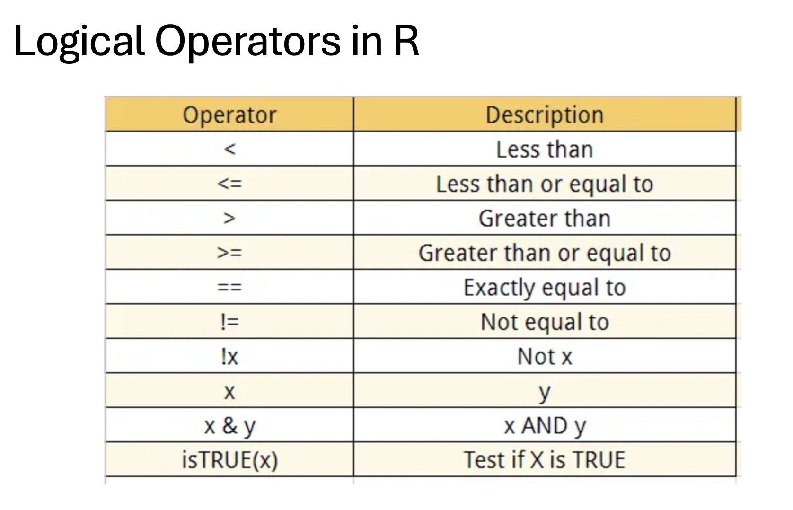

<br>
<div class = "blue">
### Learning objectives
1. **Understanding Basic R Operations**: 
   - Learn to perform basic arithmetic operations such as addition, subtraction, multiplication, division, and exponentiation in R.
   - Understand how to assign values to variables.
   - Familiarize with different methods of subsetting vectors, including indexing, logical conditions, and functions like `subset()`.

2. **Working with Basic Data Structures in R**:
   - Gain knowledge about fundamental data structures in R such as vectors, matrices, arrays, lists, and data frames.
   - Understand how to create and manipulate these data structures.
   - Learn about subsetting data frames based on specific conditions using logical operators (`&`, `|`, `!`).

3. **Logical Operators in Data Subsetting**:
   - Understand the usage of logical operators (`&` for "AND", `|` for "OR", `!` for "NOT") in subsetting data frames.
   - Learn to combine logical operators to create complex conditions for data subsetting.

4. **Practical Application**:
   - Apply the learned concepts in practical scenarios such as subsetting data frames based on multiple conditions.
   - Execute R code snippets provided in the document to practice and reinforce understanding


</div>
<br>


## Getting started

Open R program on your computer and look into your command window. It displays a “>” symbol, referred to as the “prompt”. The prompt indicates that R is idle and waits for user input, or commands to execute. In general, each command in R generates output (some commands choose to explicitly suppress their output, as we will see later). If you type a command at the prompt and press enter, R will immediately proceed to executing the command. If no errors occurred and execution finished successfully, the output of your command will be printed into next line(s) in the command window, right after the input (command) itself.

Note also that symbol “#” indicates start of a comment in R: everything starting from that symbol and through the end of the line is completely ignored by R.

We will use this feature often in order to add inline comments to the code snippets – whether you copy just the command itself from these notes, or the full line (command + comment) into your R session, both will execute and produce exactly the same result (try it, and make sure you do not copy the prompt itself!) In other words, when the code snippet looks like:

```{r}

2 + 2 # comment, ignored by R; command in this line adds 2 and 2

```


In R, you can perform a wide range of operations for data manipulation, mathematical computations, statistical analysis, and more. Here's a brief overview of some of the basic operations you can perform in R:

## Arithmetic Operations: 
R supports basic arithmetic operations such as addition, subtraction, multiplication, division, and exponentiation.

```{r}
# Addition
3 + 5
   
# Subtraction
10 - 3
   
# Multiplication
4 * 6
   
# Division
20 / 5
   
# Exponentiation
2 ^ 3
```

## Assignment:
Assign values to variables using `<-` or `=`.
```{r}
x <- 10
y = 5
```

## Subsetting:
Subsetting vectors in R allows you to extract specific elements or subsets of elements from a vector based on certain criteria. There are different ways to subset vectors, including indexing, logical conditions, and using functions like `subset()`. Here are some examples:


```{r}
# Create a numeric vector
nums <- c(10, 20, 30, 40, 50)

# Check the number of element in vector 
length(nums)

# Check the type of element in vector object
mode(nums)

# Extract the second element of the vector
nums[2]  # Output: 20

# Extract elements 2 to 4
nums[2:4]  # Output: 20 30 40
```

## Indexing
You can subset a vector using square brackets `[ ]` with numeric indices indicating the positions of the elements you want to extract.


### Logical Indexing
You can use logical conditions to subset a vector based on certain criteria.

```{r}
# Create a logical vector
logic <- c(TRUE, FALSE, TRUE, FALSE, TRUE)

# check the type of element 
mode(logic)
is.logical(logic)

# Subset elements where the corresponding logical value is TRUE
nums[logic]  # Output: 10 30 50
```

### Negative Indexing
You can use negative indices to exclude certain elements from the vector.

```{r}
# Exclude the third element from the vector
nums[-3]  # Output: 10 20 40 50
```

### Using Functions
You can use functions like `subset()` to subset vectors based on conditions.

```{r}
# Create a vector
fruits <- c("apple", "banana", "orange", "grape", "kiwi")

# check the type of element 
mode(fruits)
is.character(fruits)

# Subset elements that start with the letter 'a'
subset(fruits, substr(fruits, 1, 1) == "a")  # Output: apple
```

These are just a few examples of how you can subset vectors in R. Subsetting is a powerful feature that allows you to extract specific elements or subsets of elements from vectors, which is essential for data manipulation and analysis.


## Basic data structures in R
In R, there are several basic data structures that are fundamental for storing and manipulating data. These data structures include:

### Vectors
Vectors are one-dimensional arrays that can hold elements of the same data type, such as numeric, character, logical, etc.

```{r}
numeric_vector <- c(1, 2, 3, 4, 5)
character_vector <- c("apple", "banana", "orange")
logical_vector <- c(TRUE, FALSE, TRUE)
```

### Matrices
Matrices are two-dimensional arrays with rows and columns that contain elements of the same data type.
```{r}
my_matrix <- matrix(1:9, nrow = 3, ncol = 3)

# check the dimension of matrix object
dim(my_matrix)

# check the elements in matrix object
str(my_matrix)
```
Since my_matrix has 3 rows and 3 columns, dim(my_matrix) will output [1] 3 3, indicating that the matrix has 3 rows and 3 columns.

### Arrays
Arrays are multi-dimensional extensions of matrices that can have more than two dimensions.
```{r}
my_array <- array(1:12, dim = c(3, 2, 2))


```
### Lists
Lists are collections of elements that can be of different data types, including other lists.

```{r}
my_list <- list(
   numeric_vector = c(1, 2, 3),
   character_vector = c("apple", "banana", "orange"),
   nested_list = list(inner_numeric_vector = c(4, 5, 6))
)

# check the length of list object
length(my_list)

# check the type of element in the list
str(my_list)

# get the name of object in the list
names(my_list)

# use name to select the component from the list object
# by position
my_list[1]

# or by name
my_list$numeric_vector
```

### Data Frames
Data frames are two-dimensional structures similar to matrices, but columns can contain elements of different data types. They are commonly used for storing structured data.

```{r}
my_df <- data.frame(
   Name = c("Alice", "Bob", "Charlie"),
   Age = c(25, 30, 35),
   Married = c(TRUE, FALSE, TRUE)
)

# check the dimesion of data frame
dim(my_df)

# inspect the elements
str(my_df)

```

#### Subsetting data frames

```{r}
# Subset rows where Age is greater than 30
subset_df <- my_df[my_df$Age > 30, ]

# Subset only the Name and Married columns
subset_df <- my_df[, c("Name", "Married")]

# Subset rows where Age is greater than 25 and Married is TRUE
subset_df <- my_df[my_df$Age > 25 & my_df$Married == TRUE, ]

# Subset rows where Age is less than or equal to 30
subset_df <- subset(my_df, Age <= 30)

```

##  Logical operators
In R, you can use the logical operators `&` for "AND", `|` for "OR", and `!` for "NOT" when subsetting dataframes.
Here are examples demonstrating their use:


1. "AND" (`&`):
```{r}
# Subset rows where Age is greater than 25 AND Married is TRUE
subset_df <- my_df[my_df$Age > 25 & my_df$Married == TRUE, ]
subset_df
```

2. "OR" (`|`):
```{r}
# Subset rows where Age is less than 30 OR Married is TRUE
subset_df <- my_df[my_df$Age < 30 | my_df$Married == TRUE, ]
subset_df
```

3. "NOT" (`!`):
```{r}
# Subset rows where Name is NOT "Bob"
subset_df <- my_df[my_df$Name != "Bob", ]
subset_df
```
We can combine these logical operators to create more complex conditions when subsetting dataframes in R.For example:

Let's say we want to subset my_df to include rows where the Age is greater than 25 OR (Married is TRUE AND Name is not "Bob"):

```{r}
# Subset rows where Age is greater than 25 OR (Married is TRUE AND Name is not "Bob")
subset_df <- my_df[my_df$Age > 25 | (my_df$Married == TRUE & my_df$Name != "Bob"), ]
subset_df
```

{width=1000px}
