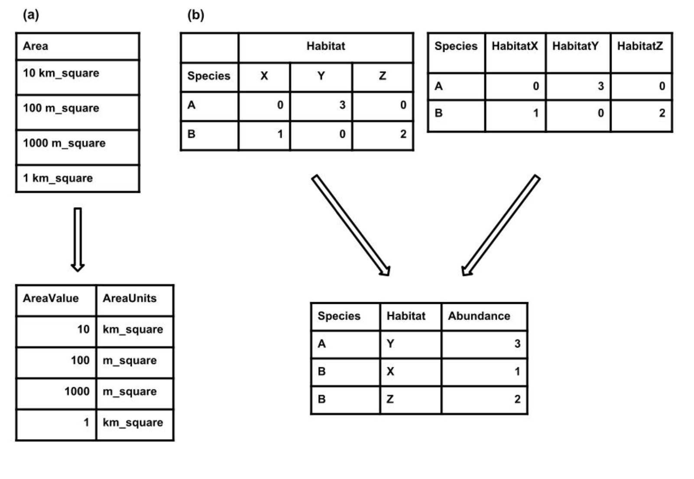

 

## Objective:

To promote efficient data management and interoperability through adherence to standard file formats and table structures.

## Key Points:

1. Utilize standard file formats, such as comma-delimited text files (.csv), to ensure compatibility across various software platforms.
   
2. Adopt standard table formats where each row represents a single observation and each column represents a single variable or type of measurement, enhancing data integrity and usability.
   
3. Use standard formats within cells to maintain consistency and facilitate data interpretation.

 

### Use standard file formats

Everyone possesses their preferred methods for storing and examining data. Opting for a standard format facilitates seamless utilization of your data across various software platforms. Effective standard formats encompass file type, data structure, and file content specificity.

- To enhance reusability, use the simple data file such as text file. These text files utilize delimiters to distinguish between different columns, with commas being the most prevalent delimiter (e.g., comma-delimited text files with the .csv extension).

- In contrast to plain text files, proprietary formats like those used by Microsoft Excel (e.g., .xls, .xlsx) can present challenges when loading into other programs. 

- When naming files, it's advisable to use descriptive names for easy tracking of their contents. 

- Additionally, it's recommended to avoid spaces in file names, as they can cause software-related issues. Spaces can be circumvented by employing camel case (e.g., RainAvg) or by separating words with underscores (e.g., rain_avg).

### Use standard table formats
Tabular data provides a great deal of flexibility in how data can be structured; however, its often hard to get a consistent format across the users. 

- Each row should represent a single observation (i.e., record) and each column should represent a single variable or type of measurement (i.e., field) 

- Every cell should contain only a single value. For example, do not include units in the cell with the values (Figure) or include multiple measurements in a single cell

- There should only be one column for each type of information. The most common violation of this rule is [cross-tab structured data](https://en.wikipedia.org/wiki/Contingency_table), where different columns contain measurements of the same variable (e.g., in different sites, treatments, etc.; Figure 1).

Cross-tab data, while readable, hinders linking records with additional data and is incompatible with common database management and analysis tools.In R (with the melt() function in the reshape package), can help restructure such data.

{width=500xpx}
**Figure:** Examples of how to restructure two common issues with tabular data. **(a) Each cell should only contain a single value.** If more than one value is present then the data should be split into multiple columns. **(b) There should be only one column for each type of information**. If there are multiple columns then the column header should be stored in one column and the values from each column should be stored in a single column. *[Source: White et., al, 2013](https://peerj.com/preprints/7/)*

### Use standard formats within cells
- Be consistent. For example, be consistent in your capitalization of words, choice of delimiters, and naming conventions for variables.
- Avoid special characters. Most software for storing and analyzing data works best on plain text, and accents and other special characters can make it difficult to import your data
- Avoid using your delimiter in the data itself (e.g., commas in the notes filed of a comma- delimited file). This can make it difficult to import your data properly. This means that if you are using commas as the decimal separator (as is often done in continental Europe) then you should use a non-comma delimiter (e.g., a tab).
- When working with dates use the YYYY-MM-DD format (i.e., follow the ISO 8601 data standard). In R, we can use lubridate package, that allows us to convert various date and time format to YYYY-MM-DD format. 

This lesson is adapted from [Nine simple ways to make it easier to (re)use your data](https://peerj.com/preprints/7/)

