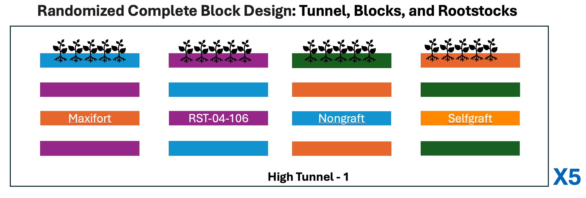

<br>
<div class = "blue">
### Learning objectives
* Understand the procedure for employing `read.csv()` to import a CSV file into R. 
* Familiarize with navigating and examining a data frame. 
* Acquire the ability to filter and extract subsets of a data frame based on specific conditions.


</div>
<br>


Now we have learned the basic operators and data structures in R, we will focus on using these learned concept in analyzing the actual data. We will be using the data collected for tomato grafting project in 2018. Although this data is simulated for the propose of this workshop, following is the basic experimental design and brief background.


## Tomato grafting
### Background
Tomato grafting is an ancient propagation practice in agriculture that is commonly used in vegetable production. In the case of tomato, interspecific rootstocks, where rootstock and scion belong to different species of Solanum, generally have a rootstock resistant to soilborne diseases (e.g., Fusarium wilt, Verticillium wilt, bacterial wilt, and root-knot nematodes) grafted with a scion that produces higher-quality fruit. In addition to the effectiveness of grafted plants in managing soilborne diseases, grafted plants are often more vigorous and more efficient in nutrient uptake and resource utilization, as well as resistant to abiotic stresses. Thus, plants grafted with effective and vigorous rootstocks often provide higher fruit yield and plant biomass.

Given the benefits of grafting, researcher ran experiments where three rootstock genotypes (BHN589, RST-04-106, and Maxifort) representing four different treatments, as follows: 

  (i). nongrafted BHN589 plants, 

  (ii). self-grafted BHN589 plants (plants grafted to their own rootstock), 

  (iii). BHN589 grafted on RST-04-106, and 

  (iv). BHN589 grafted on Maxifort. 

The choice of BHN589 as scion was primarily based on the popularity of BHN589 for its high fruit yield and quality and long shelf life. We selected Maxifort because it is a common and popular rootstock and RST-04-106 as a new rootstock variety based on breeders’ recommendations.


### Experimental design
The four graft treatments were assigned to four plots per block in a randomized complete block design. Experiments were replicated in 5 different tunnels. 


{width=500xpx}

You can read more about this research at [Poudel et., al, 2019 ](https://www.ncbi.nlm.nih.gov/pmc/articles/PMC6328775/) or [Garrett Lab](https://www.garrettlab.com/bacteria/)


### Downloading the data
Download the data, and save these csv files inside `input_data` folder within `RiceInNepal` project folder that we created earlier, on Desktop. 

* [Yield Data](https://github.com/ravinpoudel/RiceInNepal/blob/main/input_data/tomato_grafting_yield_spad.csv)

* [Metadata](https://github.com/ravinpoudel/RiceInNepal/blob/main/input_data/tomato_grafting_metadata.csv)


### Loading the Data
Our input data is ready to be load and analyze with R.  We can read it into R and assign it to an object by using the `read.csv()` function. The first argument to `read.csv()` is the path of the file you want to read, in quotes. This path will be relative to your current working directory, which in our case is the R Project folder. So from there, we want to access the `input_data` folder, and then the name of the  `CSV file`.

```{r}
yield_df <- read.csv("input_data/tomato_grafting_yield_spad.csv", header=TRUE)

# view head of the data object
head(yield_df)

# check the dimension of dataframe
dim(yield_df)

# check the data types in each column of dataframe
str(yield_df)

```

Sure, here are some examples of subsetting operations for a dataframe `yield_df` based on different conditions:

1. Subsetting based on a single condition:
```{r}
# Subset rows where SPAD value is greater than 50
s_g80_df <- yield_df[yield_df$spad_value > 80, ]
s_g80_df
```

2. Subsetting based on multiple conditions:
```{r}
# Subset rows where SPAD value is greater than 50 and yield is less than 100
s_g80_y_g50_df <- yield_df[yield_df$spad_value > 80 & yield_df$marketable_yield_kg > 50, ]
s_g80_y_g50_df
```

3. Subsetting based on column names:
```{r}
# Subset dataframe to select only SPAD and yield columns
yield_df_sel_sy <- yield_df[, c("spad_value", "marketable_yield_kg")]
head(yield_df_sel_sy)
```

4. Subsetting based on specific values in a column:
```{r}
# Subset rows where the cultivar is 'A'
yield_df_sel_mp1 <- yield_df[yield_df$plantID == 'T1-B1-M-P1', ]
yield_df_sel_mp1
```


5. Subsetting based on row numbers:
```{r}
# Subset first 10 rows of the dataframe
yield_df_sub_r_1_5 <- yield_df[1:5, ]
yield_df_sub_r_1_5
```


6. Subsetting columns from index 2 to 4:
```{r}
yield_df_sub_c2_4 <- yield_df[, 2:4]
head(yield_df_sub_c2_4)
```

7. Subsetting rows and columns simultaneously:
```{r}
yield_df_sub_r1_5_c2_4 <- yield_df[5:10, 2:4]
yield_df_sub_r1_5_c2_4
```


**How to name object variable in R?**
```
# Good variable name
car_sales_data <- read.csv("car_sales.csv")

# Avoid using reserved words
# Avoid: data <- read.csv("car_sales.csv") 

# Use descriptive names
# Good variable name
customer_list <- read.csv("customer_data.csv")

# Use snake_case:
# Snake_case is a naming convention where words are written in lowercase letters and separated by underscores. 
# Good variable name
monthly_sales_data <- read.csv("monthly_sales.csv")


```


**How to NOT name variable in R?**

```
# Bad variable name - too short and unclear
x <- read.csv("car_sales.csv")

# Bad variable name - using cryptic abbreviations
csd <- read.csv("car_sales.csv")

# Bad variable name - overly long and verbose
this_is_the_variable_representing_the_dataset_containing_car_sales_data <- read.csv("car_sales.csv")

# Bad variable name - starts with a number
# Avoid: 2022_sales_data <- read.csv("sales_2022.csv")

# Bad variable name - using special characters other than underscore
# Avoid: sales-data <- read.csv("sales.csv")

```