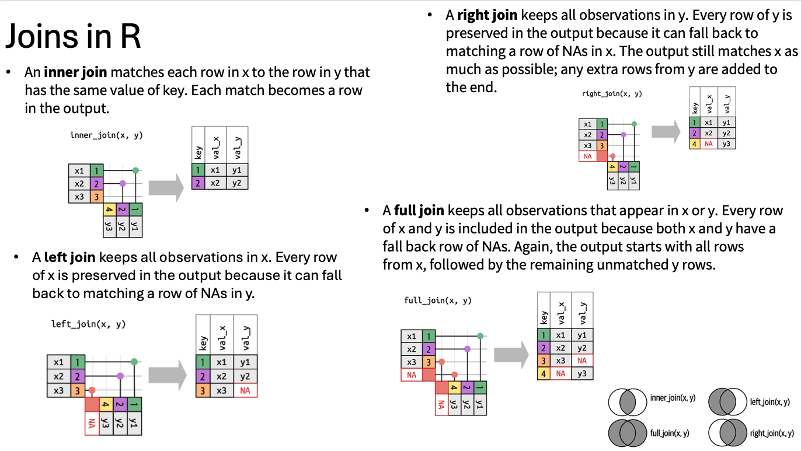

<div class = "blue">

### Learning Objectives

* Explain the purpose of the *`dplyr`* and *`tidyr`* packages.
* Use the *`select`* function from dplyr to pick specific columns from a data frame.
* Utilize the *filter* function from dplyr to choose specific rows based on filtering conditions.
* Employ the pipe operator `%>%` to seamlessly connect the output of one dplyr function to another.
* Expand data frames by creating new columns derived from existing ones using **`mutate`**.
* Leverage `summarize`, `group_by`, and `count` to break down a data frame into subsets, compute summary statistics for each subset, and then merge the results.

</div>

## Data Manipulation using **`tidyverse`**

Bracket subsetting, while useful, can become cumbersome and challenging to interpret, especially for complex operations.

**`dplyr`**. It's a package designed to simplify tabular data manipulation tasks, providing a more intuitive approach. **`dplyr`** pairs seamlessly with **`tidyr`**, which facilitates swift conversion between various data formats, aiding in visualization and analysis.

In R, packages extend the functionality of the base language by providing additional functions for various tasks. While R comes with built-in functions like `str()` and `data.frame()`, packages offer a broader range of tools. To use a package, you typically need to install it on your system initially and then import it into your R session whenever needed. The **`tidyverse`** package, which you should already have installed, is particularly valuable. It serves as an "umbrella-package," bundling together several essential packages for data analysis, including **`tidyr`**, **`dplyr`**, **`ggplot2`**, and **`tibble`**, among others, ensuring they work harmoniously together.

To install the package type:
```{r, message = FALSE, purl = FALSE, warning = FALSE}
# install.packages("tidyverse")
# install.packages("ggpubr")

```

To load the package type:


```{r, message = FALSE, purl = FALSE, warning = FALSE}
library("tidyverse")    ## load the tidyverse packages, incl. dplyr
```


We'll read in our data using the `read.csv()` function. You should have already downloaded and organized data from the github repo. 


```{r,results = 'hide', purl = FALSE}
yield_df <- read.csv("input_data/tomato_grafting_yield_spad.csv", header = TRUE)

## inspect the data
str(yield_df)


# head of the data
head(yield_df)
```

Notice that the class of the data is now `tbl_df`
This is referred to as a "tibble".
Tibbles are almost identical to R's standard data frames, but they tweak some of the old behaviors of data frames. For our purposes the only differences between data frames
and tibbles are that:

1. When you print a tibble, R displays the data type of each column |> under its name; it prints only the first few rows of data and only as many columns as fit
on one screen.
2. Columns of class `character` are never automatically converted into factors.

## Selecting columns and filtering rows

We're going to learn some of the most common **`dplyr`** functions: `select()`,
`filter()`, `mutate()`, `group_by()`, `summarize()`, and `join`. To select columns of a
data frame, use `select()`. The first argument to this function is the data
frame (`yield_df`), and the subsequent arguments are the **columns** to keep.

```{r, results = 'hide', purl = FALSE}
head(select(yield_df, plantID, sampling_date))
```
We can also use pipe function to make it more clear. Pipes let you take
the output of one function and send it directly to the next, which is useful
when you need to do many things to the same dataset.  Pipes in R look like
`%>%` and are made available via the **`magrittr`** package, installed automatically
with **`tidyverse`**. 

```{r}
library(tidyverse)
yield_df %>% select(plantID, sampling_date) %>%
  head()
```


To choose **rows** based on a specific criteria, use `filter()`:

```{r, purl = FALSE}
yield_df %>% filter(sampling_date=="6/15/18") %>%
  head()
```

`select` is used for **rows** and `filter` is used for **columns**.


What if you want to select and filter at the same time? 
Let say we want to select select plantID, sampling date, and filter marketable yield greater than 50.


```{r, purl = FALSE}
yield_df %>% 
  select(plantID, marketable_yield_kg, sampling_date) %>%
  filter(marketable_yield_kg > 50) %>%
  head()
```

In the above code, we use the pipe to send the `yield_df` dataset first through
`select()` to select the three columns of interest, then we use `filter()` to filter out rows that is greater tan 50. Since `%>%` takes
the object on its left and passes it as the first argument to the function on
its right, we don't need to explicitly include the data frame as an argument
to the `filter()` and `select()` functions any more.

Some may find it helpful to read the pipe like the word "then". For instance,
in the above example, we took the data frame `yield_df`, *then* we `filter`ed
for rows with `marketable_yield_kg > 50`, *then* we `select`ed columns `plantID`, `marketable_yield_kg`,
and `sampling_date`. The **`dplyr`** functions by themselves are somewhat simple,
but by combining them into linear workflows with the pipe, we can accomplish
more complex manipulations of data frames.

If we want to create a new object with this smaller version of the data, we
can assign it a new name:

```{r, purl = FALSE}
yield_g_50 <- yield_df %>% 
  select(plantID, marketable_yield_kg, sampling_date) %>%
  filter(marketable_yield_kg > 50)


head(yield_g_50)
```

Note that the final data frame is the leftmost part of this expression.

<div class = "blue">
### Challenge 
Can you selec the samples with marketable_yield greater than 50 for the sampled collected in june but not july? 

<details>
<summary>ANSWER</summary>
```{r, eval=FALSE, purl=FALSE}

yield_g_50_june <- yield_df %>% 
  select(plantID, marketable_yield_kg, sampling_date) %>%
  filter(marketable_yield_kg > 50 & sampling_date=="6/15/18") %>%
  head()

# what about negative selection


yield_g_50_m2 <- yield_df %>% 
  select(plantID, marketable_yield_kg, sampling_date) %>%
  filter(marketable_yield_kg > 50 & sampling_date!="july-15-2018") %>%
  head()
```
</details>
</div>
<br>

## Mutate

Frequently you'll want to create new columns based on the values in existing
columns, for example to do unit conversions, or to find the ratio of values in two
columns. For this we'll use `mutate()`.

To create a new column of weight in kg:

```{r, purl = FALSE}
yield_df %>%
  mutate(marketable_yield_gram = marketable_yield_kg * 1000) %>%
  head()
```

You can also create a second new column based on the first new column within the same call of `mutate()`:

```{r, purl = FALSE}

yield_df %>%
  mutate(marketable_yield_gram = marketable_yield_kg * 1000, 
         marketable_yield_lbs = marketable_yield_kg * 2.2) %>%
  head()
```

If this runs off your screen and you just want to see the first few rows, you
can use a pipe to view the `head()` of the data. (Pipes work with non-**`dplyr`**
functions, too, as long as the **`dplyr`** or `magrittr` package is loaded).

```{r, purl = FALSE}

yield_df %>%
  mutate(marketable_yield_gram = marketable_yield_kg * 1000, 
         marketable_yield_lbs = marketable_yield_kg * 2.2) %>%
  head()
```
How to deal with NA in data?
Although the example data set that we are working here doesnot have NA. Lets  modify the dataframe and work with it. For now you can just run the following code.
```{r}
yield_wit_NA_df <- yield_df %>%
  mutate(raw_yield = ifelse(marketable_yield_kg < 20, NA, marketable_yield_kg)) %>%
  head()
```


The first few rows of the output are full of `NA`s, so if we wanted to remove
those we could insert a `filter()` in the chain:

```{r, purl = FALSE}
yield_wit_NA_df %>%
  filter(!is.na(raw_yield)) %>%
  mutate(marketable_yield_gram = marketable_yield_kg * 1000) %>%
  head()
```

`is.na()` is a function that determines whether something is an `NA`. The `!`
symbol negates the result, so we're asking for every row where weight *is not* an `NA`.

<div class = "blue">
### Challenge

Create a new data frame from the `yield_wit_NA_df` data that meets the following
criteria: contains only the `plantID`, `sampling_date` columns, and a new column called
`marketable_yield_lbs` containing values of marketable yield in pound (lbs). Note: 1kg ~ 2.2lbs
In this `marketable_yield_lbs` column, there are no `NA`s and all values are less
than 100lbs and belong to july sampling. Name this data frame `yield_july_lbs_df`.

**Hint**: think about how the commands should be ordered to produce this data frame!

<details>
<summary>ANSWER</summary>
```{r, eval=FALSE, purl=FALSE}
yield_july_lbs_df <- yield_wit_NA_df %>%
    filter(!is.na(raw_yield)) %>%
    filter(sampling_date=="july-15-2018") %>%
    mutate(marketable_yield_lbs = marketable_yield_kg * 2.2) %>%
    filter(marketable_yield_lbs > 100 ) %>%
    select(plantID, sampling_date, marketable_yield_lbs)
```
</details>
</div>
<br>

## Group by and summarize

Many data analysis tasks can be approached using the *split-apply-combine*
paradigm: split the data into groups, apply some analysis to each group, and
then combine the results. **`dplyr`** makes this very easy through the use of the
`group_by()` function.

`group_by()` is often used together with `summarize()`, which collapses each
group into a single-row summary of that group.  `group_by()` takes as arguments
the column names that contain the **categorical** variables for which you want
to calculate the summary statistics. So to compute the mean `weight` by sex:

```{r, purl = FALSE}
yield_df %>%
  group_by(sampling_date) %>%
  summarize(mean_weight = mean(marketable_yield_kg, na.rm = TRUE))
```

You may also have noticed that the output from these calls doesn't run off the
screen anymore. It's one of the advantages of `tbl_df` over data frame.

## Join
Often we have multiple table to work with, and in dplyr we can combine different related table using joins. 
Lets bring in our metadata file,  join with the yiled data. This will allow us to answer more interesting meaningful question regarding tomato yield across various rootstocks that we studied in this work.


```{r}
meta_df <- read.csv("input_data/tomato_grafting_metadata.csv", header = TRUE)
str(meta_df)

# merge metadata with yield data
yield_with_meata_df <- merge(yield_df, meta_df, by="plantID")

head(yield_with_meata_df)
```

{width=1000px}


You can also group by multiple columns:

```{r, purl = FALSE}

yield_with_meata_df %>%
  group_by(rootstock, sampling_date) %>%
  summarize(mean_weight = mean(marketable_yield_kg, na.rm = TRUE))
```

Here we are getting average marketable_yield_kg by rootstocks and two sampling dates.

Once the data are grouped, you can also summarize multiple variables at the same
time (and not necessarily on the same variable). For instance, we could add a
column indicating the mean spad for each rootstock:

```{r, purl = FALSE}
yield_with_meata_df %>%
  group_by(rootstock) %>%
  summarize(mean_weight = mean(marketable_yield_kg),
            mean_spad = mean(spad_value))
```


<div class = "blue">
### Challenge

1. Find  maximum yiled by rootstocks in each sampling date Arrange the table by smapling date by in descending date, i.e july first, then june. 

2. Try out a new function, `count()`. Group the data by `rootstock` and pipe the grouped data into the `count()` function. How could you get the same result
using `group_by()` and `summarize()`? Hint: see `?n`.

2. Are the number of sample per rootstocks same for june and july?

<details>
<summary>ANSWER</summary>
```{r, purl=FALSE}
## Answer 1
yield_with_meata_df %>%
  group_by(rootstock, sampling_date) %>%
  summarize(max_yiled = max(marketable_yield_kg)) %>%
  arrange(desc(sampling_date))

## Answer 2
yield_with_meata_df %>%
  group_by(rootstock) %>%
  count()

## Answer 3
yield_with_meata_df %>%
  group_by(rootstock, sampling_date) %>%
  count()

```
</details>
</div>
<br>


