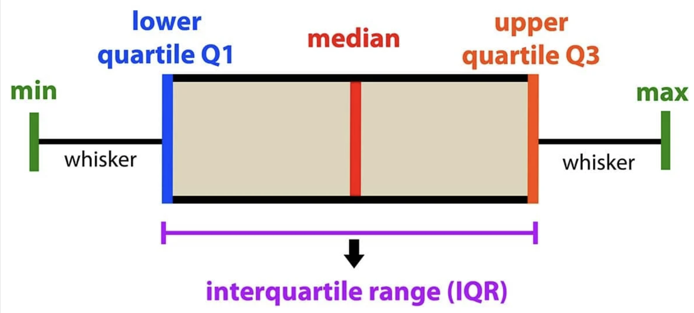

#Descriptive and Inferential Statistics

we will introduce the concepts of descriptive and inferential statistics, and briefly discuss a few most basic ways of getting an overall high-level view at the data at hand (descriptive approach). Towards this end, we will also introduce a few additional R commands and useful plots.

# Descriptive and Inferential Statistics
Statistics is about detecting trends, dependencies and features in the data in the presence of random noise and uncertainty. Statistical approaches to data analysis can be roughly categorized into descriptive and inferential, although the boundary is somewhat blurred and one rarely goes without the other. It is still useful to realize that in different situations we might be at least leaning towards one or the other end depending on the stated goal.

-Descriptive Statistics – Methods for organizing and summarizing data and information – E.g. “where is the center and what is the spread of measurements forapples and oranges in this sample?” - Inferential Statistics – Drawing conclusions about a population based on information obtained from a limited sample drawn from the population and assessing the reliability of these conclusions. – E.g. “are apples same as oranges?” Or, rather, “given the differences between measurements for apples and oranges obtained from a limited sample, how likely it is that apples and oranges in general are/are not indeed different?”

Inferential statistics uses probability theory to make generalizing statements based on the results of descriptive analysis and R has numerous methods implementing most conventional (as well as more state-of-art) approaches.


#Data Display and Characterization
```{r}
library(dplyr)
meta_df <- read.csv("input_data/tomato_grafting_metadata.csv", header = TRUE)
yield_df <- read.csv("input_data/tomato_grafting_yield_spad.csv", header = TRUE)

# merge metadata with yield data
yield_with_meata_df <- merge(yield_df, meta_df, by="plantID")

pie(table(yield_with_meata_df$rootstock))
pie(table(yield_with_meata_df$sampling_date))
```

```{r}

hist(yield_with_meata_df$spad_value)
hist(yield_with_meata_df$marketable_yield_kg)
```
```{r}

plot(yield_with_meata_df$marketable_yield_kg,type="p",main="marketable_yield_kg",ylab="Yiled ~ Kg")
plot(yield_with_meata_df$spad_value, type ="p",main="SPAD",ylab="SPAD")
```


Base plot are quick way, but we will be can use ggplot to make more interesting plots.  

# NEED TO WORK ON WHERE TO PUT THE DESCRIPTIVE AND INFERENTIAL PART? MAY BE THIS CAN BE THE PART RIGHT AFTER SUBSETTING DPLYR PART.

```{r}
mean(yield_with_meata_df$marketable_yield_kg);

median(yield_with_meata_df$marketable_yield_kg)


sd(yield_with_meata_df$marketable_yield_kg, na.rm = TRUE) 

mad(yield_with_meata_df$marketable_yield_kg, na.rm = TRUE) 
```
Note that sd() and mad() (like many other functions) have optional parameter na.rm; when it set to T it instructs the function to discard all NA’s from the input vector and apply the computations to the remaining data.

Other useful characteristics are:

**Range** is simply the min-to-max range of all observed values in the data.
```{r}
range(yield_with_meata_df$marketable_yield_kg,na.rm=T) # range of all observed values, min to max
```

**Interquartile range(IQR)** is yet another robust characteristic of the data defined similarly to a median. Namely, just like the median is the midpoint of the data, we can also define a lower quartile (Q1) as a value such that 25% of the observed data values are below Q1. Similarly, the upper quartile (Q3) is such a value that only 25% of the observed values are above (Q3), and the rest is below Q3. Interquartile distance is then defined as `IQR=Q3-Q1`.

```{r}
IQR(yield_with_meata_df$marketable_yield_kg,na.rm=T) # interquartile distance
```


**Box Plot fivenum** 

To conclude this section, let us examine another extremely useful visualization of the distribution of the data values, a box-and-whisker plot (or simply a “boxplot”). Boxplot is based on the “5-number” summary of the observed data: (Min, lower quartile, median, upper quartile, max).


```{r}

fivenum(yield_with_meata_df$marketable_yield_kg, na.rm = TRUE) 

```
Here, fivenum provides:

   - First value ~ Minimum : 17.70
   - Second value ~ Q1 : 22.25
   - Third value ~  Q2/median : 32.05
   - Fourth value ~ Q3 : 45.05
   - Fifth value ~ Maximum : 51.80


In the boxplot, the box is drawn from lower to upper quartile (i.e. the height of the box is equal to IQR, 50% of the observed values are within the box), the median of the data is marked with a line inside the box, and the whiskers show the tails of the distribution of the data: lower whisker is drawn to Lower quartile – 1.5 IQR or to the Min, whichever is greater, and the upper whisker extends to Upper quartile + 1.5 IQR or to the Max, whichever is less. Data points that fall outside of the whiskers (i.e. those that are located far from the center and are likely outliers and/or very long tails of the distribution) are drawn, if present, as individual dots. The commands and the resulting plots are shown below.

<div style="display: flex; justify-content: center; align-items: center; height: 30vh;">
  
  {width=500px}

</div>


```{r}
# Create a boxplot for the 'marketable_yield_kg' column in 'yield_with_meata_df' dataframe
boxplot(yield_with_meata_df$marketable_yield_kg, na.rm = TRUE, horizontal = TRUE)

```


## Statistical Analysis
### ANOVA (Analysis of Variance Model)

**ANOVA** is often used when there are more than two groups to compare, and it helps determine whether there are statistically significant differences among the means of these groups. 

***Which rootstock shows better results? Is there a treatment effect in the mean yield across the rootstocks?***


```{r}
# how to run the ANOCA in R
help(aov)
```

The ANOVA test will evaluate whether there are significant differences in the mean `marketable_yield_kg` across different levels of the `rootstock` variable. If the p-value associated with the `rootstock` variable is below a certain significance level (e.g., 0.05), we would reject the null hypothesis, concluding that there are significant differences in `marketable_yield_kg` between at least two levels of the `rootstock` variable.


In the code `aov(formula = marketable_yield_kg ~ rootstock, data = yield_with_meata_df)`, we are conducting an Analysis of Variance (ANOVA) to explore the relationship between the `marketable_yield_kg` variable (dependent variable) and the `rootstock` variable (independent variable) using the data stored in the `yield_with_meata_df` dataframe.

Let's break down the components:

1. **`aov()`**: This function in R stands for "Analysis of Variance." It is used to perform ANOVA, which is a statistical method used to analyze the differences among group means in a sample.

2. **`formula = marketable_yield_kg ~ rootstock`**: This part defines the formula for the ANOVA. It specifies that `marketable_yield_kg` is the dependent variable, and `rootstock` is the independent variable. The `~` symbol separates the dependent variable from the independent variable.

3. **`data = yield_with_meata_df`**: This specifies the dataframe `yield_with_meata_df` from which the variables are taken. It tells R where to find the variables specified in the formula.

```{r}

m1_yield_avo <- aov(formula=marketable_yield_kg ~ rootstock, data=yield_with_meata_df) 

```


Let’s check the ‘Value’ section of the help page so we know what does it return. It returns an object, which can further be explored with print() and summary(). Let’s assign it to an object so that we can use print() and summary() on it.

```{r}
summary(m1_yield_avo)

```


### What is in the summary of the model?

The ANOVA results indicate the statistical significance of the `rootstock` variable in explaining the variation in the `marketable_yield_kg` variable. Let's interpret the key components:

- **Df (Degrees of Freedom)**: This column displays the degrees of freedom associated with the `rootstock` variable and the residuals. In this case, there are 3 degrees of freedom for `rootstock` and 156 degrees of freedom for residuals.

- **Sum Sq (Sum of Squares)**: This column shows the sum of squared deviations from the mean for `rootstock` and residuals. For `rootstock`, the sum of squares is 23478, while for residuals, it is 138.

- **Mean Sq (Mean Square)**: This is the mean square, calculated by dividing the sum of squares by the degrees of freedom. For `rootstock`, it is 7826 (23478 divided by 3), while for residuals, it is 1 (138 divided by 156).

- **F value**: This is the F-statistic, which is the ratio of the mean square for `rootstock` to the mean square for residuals. It is used to test the null hypothesis that all group means are equal. Here, the F value is 8826.

- **Pr(>F)**: This is the p-value associated with the F-statistic. It represents the probability of observing an F-statistic as extreme as, or more extreme than, the one computed from the sample data, assuming the null hypothesis (no effect of `rootstock`) is true. In this case, the p-value is less than 2e-16 (a very small number close to zero), indicating strong evidence against the null hypothesis.


Overall, the results suggested that the `rootstock` variable has a statistically significant effect on the `marketable_yield_kg` variable. The extremely low p-value indicates that the observed differences in mean `marketable_yield_kg` among different levels of `rootstock` are highly unlikely to be due to random chance.

#### Which treatments are different???

Now that we know that differences exist between our treatments, how can we find which treatments are different? We can do this by using Tukey’s post-hoc test. If you scroll down the help page of aov and go the section ‘See Also’, you will see a function TukeyHSD. This is what we need.


```{r}
TukeyHSD(m1_yield_avo) 

```

After you conduct an ANOVA and find a significant difference between the groups, Tukey's HSD test allows you to determine which specific pairs of group means are significantly different from each other. It calculates confidence intervals for all pairwise differences between group means and then compares these intervals to determine which differences are statistically significant.


<div class = "blue">
### Challenge 
Can you run the ANOVA test using SPAD value as response? Do we see the similar pattern?
<details>
<summary>ANSWER</summary>
```{r, eval=FALSE, purl=FALSE}

# build the anova model
m2_spad_avo <- aov(formula=spad_value ~ rootstock, data=yield_with_meata_df) 

# get the summary of the model
summary(m2_spad_avo)


# TukeyHSD
TukeyHSD(m2_spad_avo) 

```
</details>
</div>
<br>


## ## T test


## statistical models


#### Linear models
When we conduct experiments (measurements, surveys, etc), we collect raw data. What are these data used for? Clearly, the purpose of any study is to learn something. “Learning” means generalizing and/or finding trends, dependencies, and relations in the data. 

In contrast, representing the results of a study as 1000 data points is an exact but also the most meaningless way of conveying the findings (or lack thereof). Even in the simplest possible scenario, we want at the very least to characterize our dataset, e.g. by calculating its mean and variance. Moreover, in most cases we are studying and characterizing a sample drawn from a population and want to generalize our findings to that population. By doing so, we already make some (implicit) assumptions. For instance, if we assume that the distribution is indeed normal or reasonably close to normal (at least, some bell-shaped curve), we can use only mean and variance to characterize the distribution (higher moments are not needed), or we may want to use the t-test in order to determine whether two samples (for instance, ages of male and female patients in ALL dataset) are significantly different or not.

However, if the shape of underlying distribution is very different, e.g. has two different maxima at different locations, all our estimates would need to be done differently as well. We have seen this in Homework 2: we could still compute the mean, but it would grossly misrepresent the actual structure of the data; for instance, estimates made with t-test (which effectively looks at the means) are useless and actually misleading in this case.

When we make an assumption about underlying distribution or dependency, we say that we have a model. Since we are doing statistics and are always concerned with probability distributions of the data themselves as well as the noise, the models we are going to look at are statistical models (those that explicitly include probability distributions).


Another interesting question to ask is: if we are given multiple random variables, X, Y, … , is there any relationship (and if so, then how significant it is statistically) or they are completely unrelated. For example, those variables could be expression levels of individual genes measured in a sample of patients (thus, in our ALL dataset we already have 10K random variables (genes) measured across all 128 patients to look at), or time to remission in the disease, etc.

Statistical independence. 

The random variables X and Y are considered unrelated, or independent, when the probability to observe any value of Y does not depend on the realization of X: in other words, whatever value we have measured for X it provides us with no additional information about what values of Y we should expect (the distribution of Y stays the same). Using notations from probability theory:

 EQUAITION HERE
probability distribution of Y conditioned on X is the same as the marginal probability distribution of Y: in other words X is irrelevant for predicting the values of Y).


Here lets look if there is some relationship between the yield and spad value

```{r}

plot(yield_with_meata_df$marketable_yield_kg, yield_with_meata_df$spad_value)


```

```{r}

lm_yiled_spad <- lm(marketable_yield_kg ~ spad_value, yield_with_meata_df) 
coef(lm_yiled_spad)
print(lm_yiled_spad)
```


```{r}
# Fit a linear regression model to predict marketable_yield_kg based on spad_value
lm_yield_spad <- lm(marketable_yield_kg ~ spad_value, data = yield_with_meata_df)

# Create a scatter plot of actual data points
plot(yield_with_meata_df$spad_value,
     yield_with_meata_df$marketable_yield_kg,
     xlab = "SPAD",  # Label for x-axis
     ylab = "Marketable Yield")  # Label for y-axis

# Add predicted values as red points
points(yield_with_meata_df$spad_value,
       predict(lm_yield_spad),
       col = "red",  # Color of points
       pch = 20)     # Point type

# Add the best-fit line in blue
abline(lm_yield_spad, col = "blue")  # Add a line representing the linear regression model


```


Here's a simplified explanation of the provided code:

1. The `lm_yield_spad <- lm(marketable_yield_kg ~ spad_value, data = yield_with_meata_df)` command creates a linear regression model (`lm`) where `marketable_yield_kg` is the variable we want to predict and `spad_value` is the predictor variable. This command fits the model to the data.

2. The `coefficients()` function retrieves the coefficients from the fitted linear model. These coefficients represent the intercept and slope of the best-fit line. In our case, the intercept is approximately 11.0557, and the slope (coefficient for `spad_value`) is approximately 0.4849.

3. Based on the coefficients obtained in step 2, we can express the relationship between `marketable_yield_kg` and `spad_value` as:  
   Marketable Yield = 11.0557 + 0.4849 * SPAD [+ residuals]

4. The `plot()` function creates a scatter plot of the actual data points, with `SPAD` on the x-axis and `Marketable Yield` on the y-axis.

5. Using the `predict()` function, we calculate the predicted values of `marketable_yield_kg` for each `SPAD` value based on our fitted linear model. These predicted values are then plotted as red points on the scatter plot.

6. The `abline()` function adds a blue line to the plot, representing the linear regression line fitted to the data.

So, in summary, the code fits a linear regression model to predict `marketable_yield_kg` based on `spad_value`, retrieves the coefficients of the model, visualizes the actual data points, overlays the predicted values, and adds a line representing the best-fit linear model.


#### Quality Control for Model Fitting: Diagnostic Plots

```{r}
qqnorm(resid(lm_yield_spad))
qqline(resid(lm_yield_spad))
hist(resid(lm_yield_spad))
shapiro.test(resid(lm_yield_spad))$p.value

```
```{r}
plot(fitted(lm_yield_spad), yield_with_meata_df$marketable_yield_kg,
     xlab="Fitted",ylab="Observed")
abline(0,1,lty=2)

```


```{r}
plot(fitted(lm_yield_spad),
resid(lm(marketable_yield_kg ~ spad_value, data = yield_with_meata_df)),
xlab="Fitted",ylab="Residuals")
abline(h=0,lty=2)

```


```{r}
old.par <- par(mfrow=c(2,2),ps=16)
plot(lm_yield_spad)


```

The `plot()` function applied directly to a linear regression model (`lm` object) in R produces a set of diagnostic plots, often referred to as "residual plots". These plots help assess the assumptions and check the validity of the linear regression model. The four main diagnostic plots produced by `plot(lm_object)` are:

1. **Residuals vs Fitted Values Plot**: This plot shows the residuals (the differences between observed and predicted values) on the y-axis against the fitted values (the predicted values of the dependent variable) on the x-axis. It helps to check for patterns in the residuals, which should ideally be randomly scattered around zero with no discernible pattern. If there is a clear pattern (like a curve or funnel shape), it suggests that the relationship between the variables may not be linear, or there may be heteroscedasticity.

2. **Normal Q-Q Plot**: This plot compares the distribution of the residuals to a normal distribution. If the residuals are normally distributed, the points on the plot should follow a straight line. Departures from a straight line suggest departures from normality.

3. **Scale-Location (or Spread-Location) Plot**: This plot shows the square root of the standardized residuals against the fitted values. It helps to assess the homogeneity of variance (homoscedasticity). Ideally, the points should be randomly scattered around a horizontal line with constant variance. If the spread of points widens or narrows as the fitted values change, it suggests heteroscedasticity.

4. **Residuals vs Leverage Plot**: This plot helps identify influential data points (outliers or high leverage points) that may disproportionately affect the regression model. Data points that are outliers in the y-direction or have high leverage will be shown as points with high residuals or high leverage values, respectively. Points to watch for are those that are far away from the rest of the data in the plot.

These diagnostic plots are crucial for evaluating the assumptions of linear regression and identifying any potential issues with the model.

```{r}

anova(lm_yield_spad)  

anova(lm_yield_spad)$"Pr(>F)"[1] # we can retrieve just the p-value
```
## Categorialcal models


```{r}
boxplot(marketable_yield_kg ~ rootstock, data = yield_with_meata_df)
```


# This COULD BE NEXT PAGE
## Population Statistics vs Sample Statistics
“Population statistics” is just a name for the descriptive characterization of the whole population (with respect to particular quantity we are interested in). Note that this can be just an idealization since we usually do not have measurements for everyone in a population. The important point is that the underlying distribution of the quantity of interest, f(x), always exists. We may not know its parameters (where it is centered or how much spread it has) or even its shape, but this is exactly why we perform the measurements.

When we perform a finite number of measurements we are sampling randomly from the underlying population. Note that the word “population” itself can be somewhat misleading: it has direct meaning only if we, for instance, select a finite number of study participants from the large population and measure their cholesterol levels or poll their party affiliations. But if our measuring apparatus is subject to noise and we perform five measurements on each subject in order to overcome that noise, it is better to say that our repeated measurements are sampled from the underlying noise distribution, not a “population” of any sort. Hence, while we will be sometimes using these terms interchangeably (e.g. when we indeed sample from a human population), the universally applicable concept is that of sampling from underlying distribution and trying to determine its parameters or other interesting properties, whether that underlying distribution describes patients or some random measurement error.


# Hypothesis Testing

###  Overview
In this note we learn how to compare two samples; “compare” here means answering the question “given the fluctuations and randomness in the data and the sampling process, is it likely that the two samples at hand came from the same underlying distribution, or the differences between the samples are so pronounced that they cannot be explained by chance and we have to conclude that the samples (or rather their underlying distributions) are truly different”. We will first perform a numerical resampling experiment in a toy model derived from the tomato grafting data; then we will look at t-test and its uses.

### Comparing means

```{r}
library(dplyr)

meta_df <- read.csv("input_data/tomato_grafting_metadata.csv", header = TRUE)
yield_df <- read.csv("input_data/tomato_grafting_yield_spad.csv", header = TRUE)

# check colnames
colnames(meta_df)

# check colnames
colnames(yield_df)

# merge metadata with yield data
yield_with_meata_df <- merge(yield_df, meta_df, by="plantID")

# Box plot of yield of all data
boxplot(yield_with_meata_df$marketable_yield_kg,cex.axis=1) # all rootstocks


# stratified by rootstocks (NOTE formula syntax!!):
boxplot(marketable_yield_kg ~ rootstock , yield_with_meata_df ,cex.axis=1) # by rootstocks

# we can also look at the spad value
boxplot(yield_with_meata_df$spad_value,cex.axis=1) # all spad value

# we can also look at the spad value
boxplot(spad_value ~ rootstock , yield_with_meata_df ,cex.axis=1) # by rootstocks
```

```{r}
# Check the presence of NA
is.na(yield_with_meata_df$marketable_yield_kg)

# count
sum(is.na(yield_with_meata_df$marketable_yield_kg))

# random sampling
y_rand <- sample(yield_with_meata_df$marketable_yield_kg, size=100, replace = TRUE)

## let make random sample of yiled for maxifort and nongraft
maxi_yield <- yield_with_meata_df[yield_with_meata_df$rootstock=="Maxifort", "marketable_yield_kg"]
rst04_106_yield <- yield_with_meata_df[yield_with_meata_df$rootstock=="RST-04-106", "marketable_yield_kg"]
ng_yield <- yield_with_meata_df[yield_with_meata_df$rootstock=="Nongraft", "marketable_yield_kg"]
sg_yield <- yield_with_meata_df[yield_with_meata_df$rootstock=="Selfgraft", "marketable_yield_kg"]


# 
stripchart(list(Maxifort=maxi_yield,`RST-04-106`=rst04_106_yield, Selfgraft= sg_yield, Nongraft=ng_yield),vertical=TRUE) # compare samples

```

### Hypothesis Testing: t-test
The approach we have taken in the previous section is very common. What we did is known as “hypothesis testing”. First we formulate a null hypothesis – usually a minimalist statement assuming that there is no effect whatsoever. Under this assumption we evaluate the probability to observe the same or even more extreme value of some quantity than was actually observed. The quantity chosen for testing is known as test statistics and the probability to observe equal or more extreme value of test statistics is called p-value. If this probability is high, i.e. under the null hypothesis it is very likely to make observations as or more extreme than we did, then our data are consistent with the null. In contrast, if the probability of the observation we made is too low under the null hypothesis, we may decide that the data contradict the null and the latter should be rejected.

There are two important points to acknowledge here: 1) in hypothesis testing, the “probability to observe the value of test statistic” always refers to multiple re-testing. The question we are asking is, invariably, “what would happen if we were to repeat our whole experiment, i.e. draw new samples, over and over again – how often would we observe the test statistics as extreme, assuming the null hypothesis were true?”


 2) the test statistics is calculated for the sample (e.g. mean of the sample) and is thus a random variable itself; hence we can speak only about the probability for the test statistic to exceed any particular value. In this sense, we can only tell that a particular observation is very unlikely under the null hypothesis (i.e. has very low probability, or p-value). It is an arbitrary and subjective decision whether the probability is low enough to reject the null. One traditionally used value of the p-value cutoff is 0.05 (i.e. 5% probability that there is in fact no effect, null is correct, and the observed difference is due to chance); in many applications however, you may want to choose much more stringent cutoffs, especially in multiple testing as we will discuss later on.
 

#### T-test and usage

The test statistics of this test (known as t-statistics) is pretty much either the mean or difference between the means, properly re-scaled (there are flavors of the test for one or two samples), and the test assumes the underlying distributions(s) to be normal (Gaussian); importantly, by making these assumptions, one can obtain an analytical result and thus avoid performing 10000 re-samplings every time one needs to test for significance. In the single-sample case (the null is that the sample came from a distribution with specific mean, and the observed difference between that mean and sample mean is solely due to chance)

The test is very attractive because it is simple and computationally efficient. However, it explicitly relies on the assumption of normality of the underlying distribution(s).

```{r}
## t-test if the yield between nongraft and maxifort were sampled from the same distribution.

t.test.res = t.test(maxi_yield, ng_yield)
t.test.res
```


#### Example of t-test

```{r}
yy = c(maxi_yield, ng_yield)
tt = as.factor(c(rep("Maxi", 40), rep("NG",40)))

dd = data.frame(trt=tt, yield = yy)

# Compute the analysis of variance
anova.res <- aov(yield ~ trt, data = dd)
# Summary of the analysis
summary(anova.res)
confint(anova.res)

##
mean(maxi_yield)
mean(ng_yield)

# the square of the t-statistic from a t-test (specifically, a two-sample t-test) should be approximately equal to the F-statistic from an ANOVA analysis when comparing the means of two groups.

# t-test and anova 
cat(t.test.res$statistic^2,summary(anova.res)[[1]]$"F value"[1],fill=T)

# pvalue
cat(t.test.res$p.value,summary(anova.res)[[1]]$`Pr(>F)`[1],fill=T)
```

## Analysis of Variance
The “classical” set-up for what is known as “one-way ANOVA” is very similar to the t-test. Namely, we have n groups of measurements (i.e. samples), n≥2 , with multiple measurements (e.g. blood pressures in a number of patients) in each group (for instance, healthy controls, disease stage I, disease stage II etc.). The null hypothesis we test is that the underlying means and variances of the respective distributions all the samples were drawn from are the same:

Thus for n=2, the null hypothesis is the same both for ANOVA and for the two-sample t-test with equal variance

With larger number of samples, n>2, ANOVA is often a preferable way of testing. The reason is that regardless of the actual number of samples, n, ANOVA is still just one test applied to all samples at once. In contrast, if we were to use t-test, we could only run multiple pairwise comparisons between the samples when n>2. As a result, while the latter procedure can be applied in practice in order to get better understanding of the data, the results of such tests are subject to multiple testing errors (when performing many tests, we are bound to eventually run into a case which is significant merely by chance!)

```{r}
yield_with_meata_df
yield_with_meata_df$rootstock <- factor(yield_with_meata_df$rootstock, levels=c("Nongraft","Selfgraft","RST-04-106","Maxifort"))
yield_with_meata_df$rootstock
anova.res <- aov(lm(marketable_yield_kg ~ rootstock, data = yield_with_meata_df))
summary(anova.res)
# does the rootstocsk type expalin the yiled?
coef(lm(marketable_yield_kg~rootstock,yield_with_meata_df))

```
The first command in the code segment above fits linear model of gene expression vs fusion protein status. Since fp is a categorical variable, we should be very careful in interpreting the coefficients of this “linear fit”. Remember that when we had a “conventional” linear regression fit, y=ax+b, the slope a was the “rate of change” of the variable y: the latter would change by a when x changes by 1. Moreover, when x is numerical, we can define “greater” and “less” relations, order the values, and can have changes in x from data point to data point equal to 1.7, 2.18 or 3.1415, as obvious as it sounds. In contrast, with categorical variable fp, we have three different values, but those values do not have any order, and we cannot define a “distance” between them (by how much does fp change from p190 to p210??), so we cannot really write a term like a∗fp in our model. Instead, when linear model is fitted on categorical data, each individual level of the categorical variable is encoded as 0 (not set) or 1 (set).

Next, you can remember that in “conventional” linear models we interpreted predicted value yi as the “mean” of measurements we would expect to make when x=xi (even if in reality we had only one yi measurement for each xi, so we had to use other techniques to infer that mean). This interpretation remains exactly the same with linear models applied to categorical variables, except that in contrast to continuous variable x, when we have only a few levels of a categorical variable, it is likely that we have many measurements yi for each level. Thus we can truly compute the mean in each category, and importantly this is all we can compute: since distance between the categorical labels is not defined, we cannot define a slope as well.

Let us now examine closely the coefficients calculated by our linear model in the code fragment shown above. We can see that the “Intercept” is the mean of the first category (p190), see the explicit calculation of the mean in that category few lines below.

Next value, let’s denote it A, under p190/p210, should be interpreted as follows: when the category is p190/210 (i.e. the corresponding “flag” is 1, or “set”) then intercept+A gives the mean (in other words “predicted value”) of Y in that category. So in some sense, A is a slope, but only with respect to the indicator variable 0/1, mean(p190/210)=intercept+A*1. For p210 we need to use a different indicator variable, and different “slope” B, so that when the label is p210 (corresponding indicator is 1), then mean(fpp210)=intercept+B*1.

You can easily check that the coefficients reported by the linear model indeed give the means in the groups, when properly interpreted. This is left as a homework exercise.

Note that the means in the groups is the best and only “prediction” that we can make in this case, in the same way as a conventional linear model gives single predicted “mean” value for each “category” xiin the data, and all the deviations of measured values of y from those predictions is unexplained noise.

```{r}
# intercept is equal to mean of ng
mean(ng_yield)

# mean of sg == intercept +coefficeint for SG
cat(mean(sg_yield), coef(lm(marketable_yield_kg~rootstock,yield_with_meata_df))[2] + coef(lm(marketable_yield_kg~rootstock,yield_with_meata_df))[1])

cat(mean(rst04_106_yield), coef(lm(marketable_yield_kg~rootstock,yield_with_meata_df))[3] + coef(lm(marketable_yield_kg~rootstock,yield_with_meata_df))[1])

cat(mean(maxi_yield), coef(lm(marketable_yield_kg~rootstock,yield_with_meata_df))[4] + coef(lm(marketable_yield_kg~rootstock,yield_with_meata_df))[1])

```
#### Testing for data normality


####  Statistical Models

####  Statistical Independence


#### Linear Models


### Evaluating Linear Model

###  Quality Control for Model Fitting: Diagnostic Plots


### Central Limit Theorem


### CLT Illustration


### Confidence Intervals


### Analysis of Variance


### Between- and Within-sample Variance


#### ANOVA Examples


#### ANOVA Example: Continuous Variables

